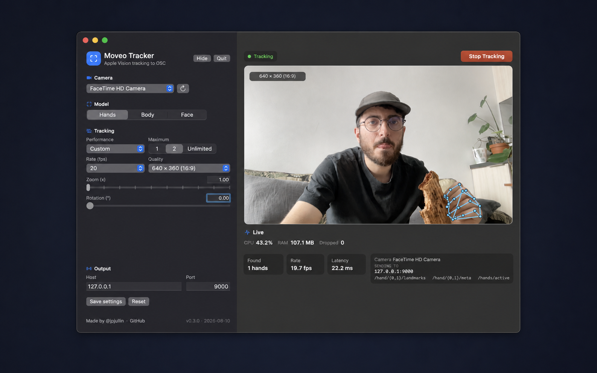

# Moveo Tracker

Apple Vision hand, body, and face tracking to OSC for macOS.



## Use

1. [Download the latest release](https://github.com/jpjullin/moveo-tracker/releases/latest).
2. Choose a camera and model.
3. Press **Start Tracking**.

The OSC destination and addresses are always visible below the camera.

## Build

```sh
bash scripts/package-app.sh
```

Made by [@jpjullin](https://github.com/jpjullin/moveo-tracker).
